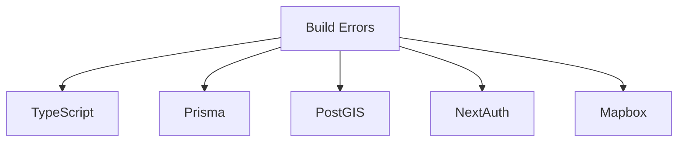
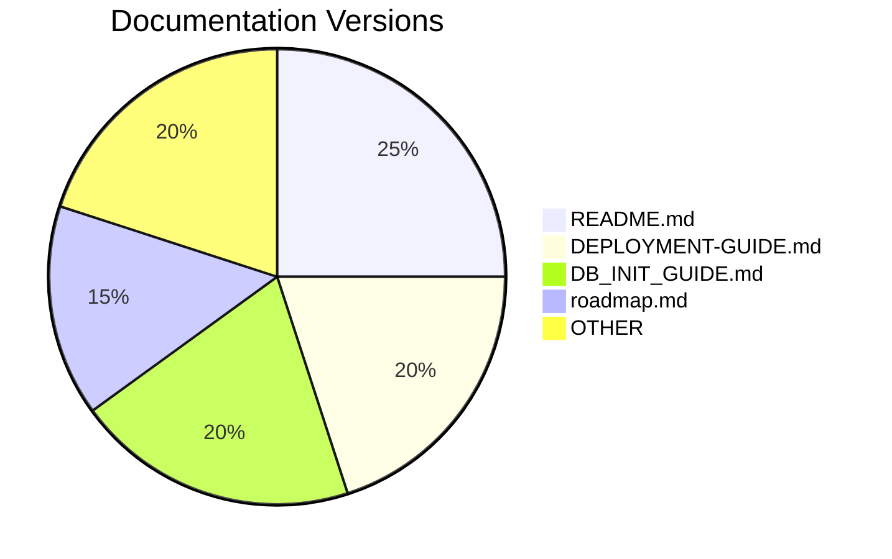
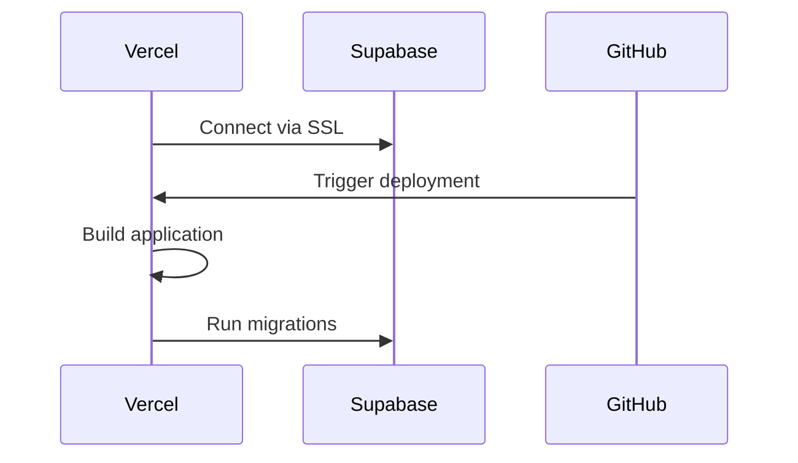
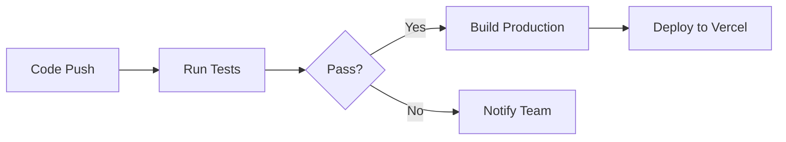

# Mechanico Final Checklist

## 1. Build Error Analysis


### 1.1 TypeScript Strict Mode
- [ ] Add index signatures to dynamic objects
- [ ] Implement type guards for API responses
- [ ] Use optional chaining for nested properties
- [ ] Add Zod validation for external data

### 1.2 Prisma Migration Conflicts
- [ ] Use `prisma migrate resolve` after manual DB changes
- [ ] Validate foreign keys before schema changes
- [ ] Avoid `db push` in production

### 1.3 PostGIS Installation
```bash
# Validation commands
SELECT PostGIS_version();
SELECT ST_Contains(region_polygon, booking_geom);
```

## 2. Documentation Updates


- [ ] Added version headers to all docs
- [ ] Created CHANGELOG.md
- [ ] Added timestamps to last updates
- [ ] Standardized section headers
- [ ] Verified Persian translations

## 3. Deployment Guides

### 3.1 Local Development
```bash
# Local setup checklist
npm install
createdb mechanico_dev
export DATABASE_URL=postgres://user@localhost:5432/mechanico_dev
npx prisma migrate deploy
npm run dev
```

### 3.2 Cloud Deployment


## 4. GitHub Integration

### 4.1 GitHub Pages Setup
```yaml
# .github/workflows/pages.yml
name: Deploy Docs
on: [push]
jobs:
  deploy:
    uses: actions/deploy-pages@v4
```

### 4.2 GitHub Actions CI/CD


## 5. UI/UX Validation

### 5.1 RTL Checklist
- [ ] Persian text rendering
- [ ] Icon mirroring
- [ ] Text alignment
- [ ] Date/currency formats

### 5.2 Booking Flow Validation
- [ ] Mobile responsiveness
- [ ] Vaul drawer transitions
- [ ] Geolocation accuracy
- [ ] Form validation

### 5.3 Accessibility Audit
- [ ] Contrast ratios
- [ ] Screen reader support
- [ ] Keyboard navigation
- [ ] Touch target sizes

## 6. Database Management

### 6.1 Safe Migration Procedures
```bash
# Production migration checklist
BACKUP_DB=mechanico-backup-$(date +%F).sql
pg_dump $DATABASE_URL > $BACKUP_DB
npx prisma migrate deploy --preview-feature
```

### 6.2 PostGIS Maintenance
- [ ] Monthly index reindexing
- [ ] Coordinate system validation
- [ ] Spatial query optimization
- [ ] Vacuum analyze operations

## Version History
| Version | Date       | Changes              |
|---------|------------|----------------------|
| v0.2.0  | 2025-12-05 | Initial checklist    |
| v0.2.1  | 2025-12-06 | Added DB validation  |